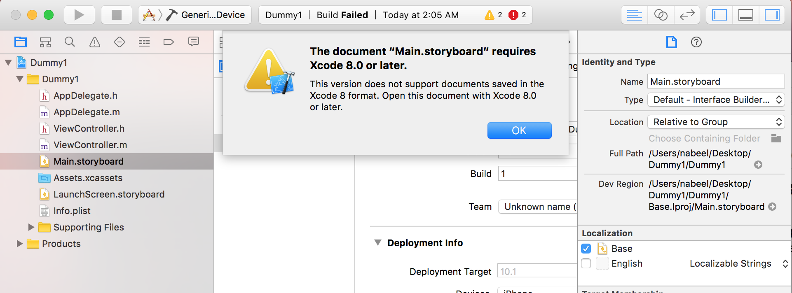
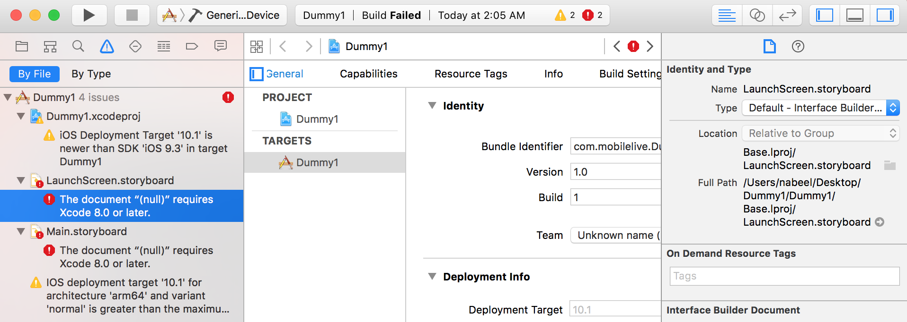
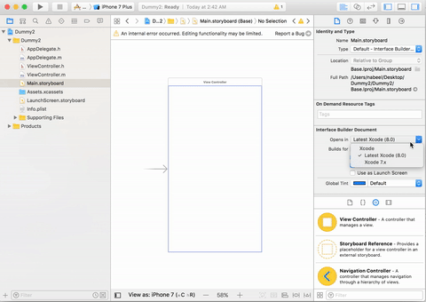
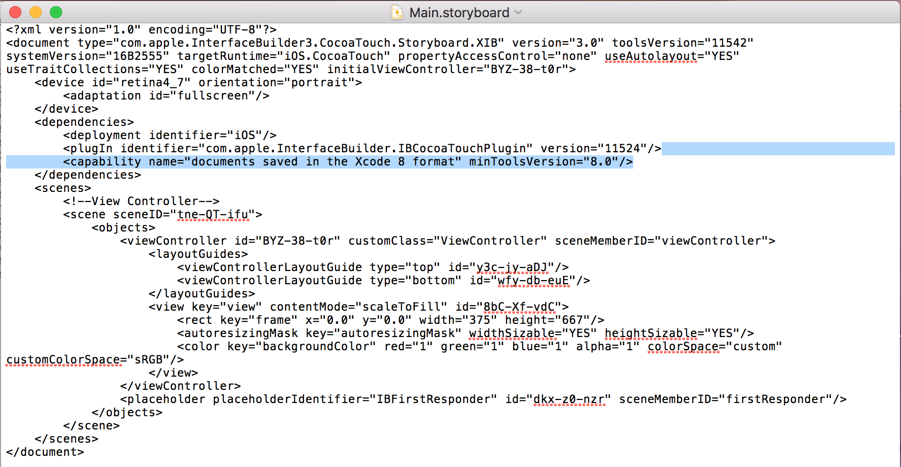
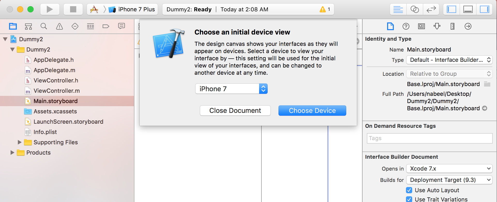
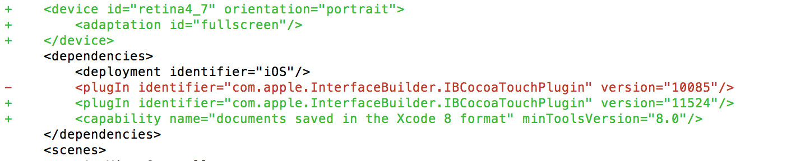

In one of my recent project I developed a module in XCode 8 as I had upgraded to it. Later I came to know that our team is currently working on XCode 7. So if we integrate XCode 8 UI files i.e .storyboard & .xib, the main project will not compile and will show following error.




```
The document "Main.storyboard" requires XCode 8.0 or later.

This version does not support documents saved in XCode 8 format. Open this document with XCode 8.0 or later.
```

```
The document "(null)" requires XCode 8.0 or later.
```

Although it is strongly recommended to upgrade your XCode as soon as some stable version arrives, there can come certain situations where you have to downgrade it. If you are a developer like me who is trying to downgrade his project to support XCode 7 here are two simple ways.

# Using XCode 8:
If you have XCode 8 installed on your system, you can use this method to downgrade your storyboard files.
- Open .storyboard/.xib file in XCode 8.0
- On right side: Utility Area > File Inspecter > Interface Builder Document
- Choose 'XCode 7.x' for 'Opens in's' value. The process is shown in GIF below:



# Using any text Editor
If you do not have access to XCode 8 at the moment you can use any of the text editors available to downgrade to XCode 7. So that you have no more build errors. 

Just open your .storyboard/.xib file in a text editor of your choice and remove following line:

```
<capability name="Document saved in the Xcode 8 format" minToolVersion="8.0"/>
```



After removing this line you will be able to compile your project successfully.

To understand why we removed above line you can explore the changes once a UI file is saved in Xcode 8 format. If you will open .storyboard or .xib file on XCode 8 first time. It will show you a dialog as shown below to make these files compatible with XCode 8 document format.

 


